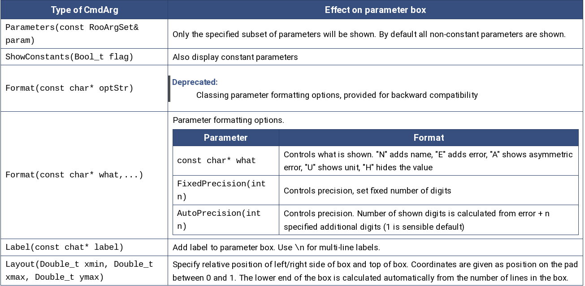

# Raccolta di macro per il framework root (Cern)
Raccolta di macro scritte durante il corso di analisi dati (terzo semestre magistrale).

Le macro sono quelle passate dal professore durante le lezioni, anche presenti sul sito [del corso](https://www.ba.infn.it/~pompili/teaching/data_analysis_lab/scientific-data-analysis-laboratory-2021-2022.html),
alle quali ho applicato alcune modifiche. (Principalmente stilistiche e di refactoring).

Ogni cartella è un'esercitazione. Ogni cartella contiene un file .C (la macro), una cartella chiamata root_files, in cui vengono letti e scritti i dati,
e una cartella Plots, in cui vengono salvati i plot generati dalle macro.


**TODO** Inserire breve descrizione di ogni esercitazione e pdf

# Es 1: Stacked plot
[Pdf dell'esercitazione](https://www.ba.infn.it/~pompili/teaching/data_analysis_lab/esercitazione-1.pdf)
**Finito**

# Es 2: Cms vs Alice
**Qui non c'è un pdf dell'esercitazione, ci siamo inventati noi la macro cercando di fare i plot**

Bisognava riprodurre i plot di questo pdf: [Cms vs FONLL](https://arxiv.org/pdf/2107.01476v1.pdf) -> figura 5 a pagina 13.
Cms vs Alice da un pptx suo che non sta sul sito.

Divisa in due parti. Nella prima [cms_vs_alice_solo_cms](./es2_cms_vs_alice_D0/cms_vs_alice_solo_cms) c'è solo il plot dei dati di cms e del rapporto tra MC e dati in cms.
Nella seconda cartella [cms_vs_alice_completa](./es2_cms_vs_alice_D0/cms_vs_alice_completa) c'è l'esercitazione completa: Ci sono i grafici di alice/cms, cms/alice, (cms-alice)/cms
e cms vs alice (che sarebbe il confronto tra i dati). **Grazie Nicola, questa l'ha finita lui**

**Finito**

# Es 3: Curva roc e test delle ipotesi
[Pdf dell'esercitazione](https://www.ba.infn.it/~pompili/teaching/data_analysis_lab/lezione-roc-higgs-4lept.pdf).


## NOTA: sulla conversione tra stringhe c++ e stringhe c-like.
In questa macro si presenta la necessità di creare una stringa fatta così "hVar1Ratio[i]" dove al posto della i devo mettere il numero. Quindi è necessario fare un'operazione complessa di gestione e concatenazione di stringhe. Questo è facile con i metodi delle stringhe della libreria std. Il costruttore di TH1D (e in generale tutti i metodi che in root vogliono le stringhe), però, prende un tipo const char *, cioè una stringa c-like, o al più una TString.
Per risolvere il problema lui faceva così
```cpp
char histoname[128];
sprintf(histoname,"hVarRatio[%d]",i);
```
Questo metodo funziona bene per il caso specifico, ma è c-like: in pratica creo un buffer di caratteri e stampo dentro il testo che mi serve usando i segnaposti da associare alle variabili.
Inoltre, con i buffer di caratteri non sono in grado di fare operazioni più complesse (tipo cambiare il case delle lettere eccetera), questo perchè l'oggetto di tipo char[] non è una classe e quindi è stateless, non può avere metodi.
C++ mette a disposizione la classe built-in `<string>` contenuta nella std library. Inoltre fornisce tutti gli strumenti per la retrocompatibilità con le stringhe c-like.
```cpp
std::string nomeHisto{"hVar" + std::to_string(varValue + 1) + "Ratio[" + std::to_string(i) + "]"};
const char *nomeHistoChar = nomeHisto.c_str(); // Converte la stringa c++ in stringa c-like
```
Quindi creo una variabile di tipo string e la inizializzo con il nome che voglio utilizzando tranquillamente l'operatore + tra `const char*` (cioè le stringhe letterali) e `string`, restituita dal metodo `to_string()` che permette la concatenazione e restituisce una `string` e uso la stringa restituita dall'operazione come argomento del costruttore della variabile di tipo `string` nomeHisto. Ho necessità, però, di una stringa c-like, quindi effettuo la conversione usando il metodo delle stringhe `c_str()`. Che restituisce un const char*.

**Finito**

# Es 4: Fit con roofit
Pdf su RooFit: 
[Lezione 1](https://www.ba.infn.it/~pompili/teaching/data_analysis_lab/Verkerke-RooFit-part1.pdf)
[Lezione 2](https://www.ba.infn.it/~pompili/teaching/data_analysis_lab/Verkerke-RooFit-part2.pdf)
[Lezione 3](https://www.ba.infn.it/~pompili/teaching/data_analysis_lab/Verkerke-RooFit-part3.pdf)

## Appunti su roofit 
Classi più usate: 
### `RooRealVar` -> Rappresenta una variabile reale.

Il costruttore che lui usa più spesso è: 

```cpp 
RooRealVar (const char *name, const char *title, Double_t value, Double_t minValue, Double_t maxValue, const char *unit="")
```
Il name è la stringa con cui viene salvata in memoria, invece il titolo è quello che viene scritto. Gli altri argomenti sono il valore iniziale e poi gli estremi.

Metodi più usati: 

- `frame()` -> Crea un nuovo oggetto di tipo `RooPlot` nella heap memory (quindi un puntatore classico) **inizializzato per questo oggetto** ma senza plot. Ha senso quindi fare `oggettoDaPlottare->PlotOn(x.frame())`. 
Puoi usare il metodo tutte le volte che vuoi e ogni volta ottieni un **nuovo** `RooPlot *`. 
**Attenzione: Il chiamante del metodo ha la responsabilità di eliminare dalla heap l'oggetto di tipo `RooPlot` restituito.**
    
- `setBins(Int_t nBins)` -> Crea un binnaggio uniforme per la variabile. 

### `RooPlot` -> Rappresenta un frame per i plot 

Metodi importanti: 

- `Draw()` -> Per disegnare gli oggetti nel canvas. (Più spesso in questi contesti si usa il metodo `plotOn()` delle `RooAbsPdf`)

- `pullHist()` -> Restituisce un istogramma con le differenze tra l'istogramma plottato sul frame e **l'ultima** pdf plottata sul frame. 

- `addObject()` -> Aggiunge un oggetto al frame per disegnarlo. Prende come argomento un `TObject *`. 
    

### `RooDataHist` -> Rappresenta un istogramma. 

Diversi costruttori, gli argomenti importanti sono: 

```cpp
RooDataHist (std::string_view name, std::string_view title, const RooArgList &vars, const TH1 *hist, Double_t initWgt=1.0)
```

Posso creare un RooDataHist da un istogramma normale(`const TH1 *`). 
Il costruttore prende anche una `RooRealVar` come variabile dell'istogramma. 

Nota che lui crea un `RooDataHist` nell'[esercitazione 4a](./es4_roofit/psiPrime_fit.C#L35). 
In quel caso al posto del costruttore scritto sopra, ne usa un altro in cui passa un `RooCmdArg` al post del `TH1 *`. Per fare questo è necessario convertire l'istogramma in `RooCmdArg` e per questo usa `Import`. 

### `RooDataset` -> E' una classe per contenere dati unbinned.

E' il corrispondente unbinned di `RooDataHist`. 

Metodi principali: 
- `write()` -> Scrive il conenuto del dataset in un file ASCII con il nome specificato.

Ha due versioni, una in cui l'argomento è `const char *` e indica il nome del file (usato nell'[esercitazione 9](./es9_MC/RooConvolutionExpNew#100)), l'altra in cui si passa direttamente l'`ofstream &`. 

- `sumEntries() const` -> Restituisce il numero di elementi nel dataset, cioè la somma di tutti i pesi.

- `sumEntries(const char * cutSpec, const char * cutRange = 0) const` -> Restituisce la somma dei pesi di tutte le entrate che matchano `cutSpec` (se specificato) e nel range di nomi `cutRange` (se specificato). 

- `createHistogram()` -> Crea e riempie un istogramma di ROOT `TH1`, `TH2` o `TH3`. 
### `Import` -> funzione di RooFit. 

Restituisce un oggetto della classe `RooCmdArg`. Permette di importare gli oggetti tipo `TH1` (ma non solo) per convertirli in `RooDataHist`. 

### `RooArgList` -> E' un oggetto container che tiene diversi oggetti di tipo `RooAbsArg` (e le classi che derivano da essa). 

Esempio: Creazione di una pdf somma di due pdf: 

```cpp
RooAddPdf* totalPDF = new RooAddPdf("totalPDF", "totalPDF", RooArgList(sigPDF, bkgPDF), RooArgList(nSig, nBkg));
```

Il costruttore di `RooAddPdf` prende una `RooArgList` che indichi la lista di pdf da sommare e una `RooArgList` che indichi la lista dei pesi. 

### `RooArgSet` -> Dovrebbe funzionare più o meno come `RooArgList`. 

### `RooAbsPdf` -> Rappresenta una pdf. Tutte le distribuzioni ereditano da questa (anche `RooAddPdf`). 

- Metodi importanti: 

    - `fitTo(RooAbsData & data, const RooLinkedList & cmdList)` -> Fitta la pdf al dataset (data). Il fit viene fatto ML unbinned o binned a seconda del dataset. Di default il fit viene fatto facendo MIGRAD, HESSE e MINOS in successione. Comunque basta passare le opzioni. 
    Restituisce un `RooFitResult *`.

    Esempio: 

    ```cpp 
    totalPDF->fitTo(*MuMuHist, Extended(kTRUE), Minos(kTRUE)); 
    ```
    `*MuMuHist` è l'oggetto su cui fittare, le altre sono le opzioni. 

    **Nota: Perchè passo \*MuMuHist e non MuMuHist (cioè passo l'oggetto puntato e non il puntatore)?** 

        Il metodo `fitTo()` prende come primo argomento un tipo `RooAbsData &`, cioè una reference a un `RooAbsData` (la reference è un modo intelligente per evitare la copia dei dati durante la chiamata in una funzione e senza usare i puntatori). Quindi ho bisogno di un oggetto di tipo `RooAbsData` e non un `RooAbsData *`, quindi devo passare il puntatore deferenziato (*MuMuHist) e non il puntatore stesso (MuMuHist). 

    - `createNLL(RooAbsData & data, const RooLinkedList & cmdList)` -> Costruisce una rappresentazione di -log(L) della pdf su un dato dataset. Restituisce una `RooAbsReal *` 

    - `generate(const RooArgSet & whatVars, ... opzioni)` -> Genera un nuovo dataset contenente la variabile specificata con gli eventi campionati dalla distribuzione. Restituisce un `RooDataSet *` Ci sono un sacco di opzioni e di diverse versioni, noi l'abbiamo usato principalmente così: 

    ```cpp 
    RooDataSet * nuovoDataSet = pdf.generate(nomeVariabile, numeroEventi); 
    ``` 

    dove `nomeVariabile` è il nome della `RooRealVar` da usare e `numeroEventi` è un intero che indica il numero di eventi da generare. 

    Per ulteriori informazioni vedi la [documentazione completa](https://root.cern.ch/doc/master/classRooAbsPdf.html#a87926e1044acf4403d8d5f1d366f6591). 

    - `plotOn(RooPlot * frame, RooLinkedList & cmdList)` -> Plotta la pdf sul frame (preparato per la variabile da cui ho estratto il frame). Si possono usare una serie di opzioni. 
    Da notare che con l'opzione `Components(const char * nome_componente)` posso plottare una sola componente delle pdf composte (tipo re `RooAddPdf`). 

    - `paramOn(RooPlot * frmae, RooLinkedList & cmdList)` -> Aggiunge un box con i parametri da mostrare, di seguito alcune delle opzioni: 
    

    Tutte le opzioni per i vari metodi si possono trovare su [questa pagina](https://root.cern.ch/doc/master/classRooAbsPdf.html#af43c48c044f954b0e0e9d4fe38347551). 

- Alcune cose utili: 

    - Cambiare la dimensione del font ai parametri dei fit plottati con `paramOn()`: 

        ```cpp
        xFrame->getAttText()->SetTextSize(0.025); 
        ``` 

    Nota che il metodo `getAttText()` restituisce un oggetto di tipo `TAttText()` che è una classe di Root normale con tutti i suoi metodi. **Da documentazione, di default la Text Size settata è 1.**

    - Cambiare lo spessore della linea (anche eliminarla) del box dei parametri con `paramOn()`

        ```cpp
        xFrame->getAttLine()->SetLineWidth(0); 
        ```

    - Nota: Su come funziona `paramOn()`

    ```cpp
    totalPdf.paramOn(xFrame, Parameters(RooArgSet(meanCB, sigmaCB, nSig, mean, sigma, nSigGaussiana)),
        Format("NEU", AutoPrecision(2)), 
        Layout(0.45, 0.9, 0.9)); 
    ```

    `Format()` permette di inserire le opzioni di visualizzazione, il primo argomento selezione cosa viene mostrato, da documentazione: << "N" adds name, "E" adds error, "A" shows asymmetric error, "U" shows unit, "H" hides the value >>. Il secondo argomento determina il numero di cifre significative da mostrare nel riquadro.


### `RooAbsReal` -> E' la classe astratta per oggetti che rappresentano un valore reale. 

Implementa funzionalità comuni come la possibilità di plottare, calcolare gli integrali eccetera. Si incontra principalmente come valore di ritorno del metodo `createNLL()` della classe `RooAbsPdf` a rappresentare una Negative Log Likelihood. 

### `RooFitResult` -> Rappresenta i risultati del fit. Oggetto restituito dal metodo `fitTo()`. 
    
Metodi principali: 
- `Print()` -> stampa i risultati del fit a schermo 
- `correlationMatrix()` -> Restituisce la matrice di correlazione (a sua volta puoi fare `r->correlationMatrix().Print()`). 

### `RooMinuit` -> E' una classe wrapper, rappresenta un'interfaccia tra Minuit e RooFit. 

Costruttore principale: 

`RooMinuit(RooAbsReal & function)` -> Costruisce l'interfaccia minuit per una data funzione. Quindi probabilmente gli passerai la funzione di likelihood generata con `pdf.createNLL()`. 

Metodi principali: 
- `migrad()` 
- `hesse()` 
- `migrad()`
- `minos()` 

In generale sono tutti i metodi da chiamare per minimizzare con diverse strategie la funzione da fittare. 

## Es 4a: Fit con gaussiana + fondo con roofit
[Pdf dell'esercitazione](https://www.ba.infn.it/~pompili/teaching/data_analysis_lab/esercitazione-roofit-invmass.pdf).
[Pdf su Migrad, Hesse e Minos](https://www.ba.infn.it/~pompili/teaching/data_analysis_lab/Approfondimento3.pdf).

Abbiamo fittato l'istogramma PsiPrimeMass_bin9 dal [file](./root_files/hlt_5_newSoftMuon_alsoInPsiPrimeWind.root) prima con gaussiana e chebychev e poi con crystal ball ed esponenziale. 
## Es 4b: Pull
[Pdf dell'esercitazione](https://www.ba.infn.it/~pompili/teaching/data_analysis_lab/Exercise3b.pdf)

Utilizzato il codice dell'esercitazione 4a per aggiungere i pull dei due fit e scegliere il fit migliore del background. 

**Nota: Ricorda sempre la correzione per i pull** 

```cpp
totalPdf->plotOn(xFrame, rf::LineColor(kRed)); 
```

Anche se hai già plottato la pdf totale e dopo le sue componenti, devi plottare tutta la pdf totale come ultima cosa prima della chiamata al metodo `pullHist()` perchè **`pullHist()` calcola la differenza tra l'istogramma e l'ultima pdf plottata**. 

**Finito**
# Es 5: Fit spettro J/#Psi
[Pdf](https://www.ba.infn.it/~pompili/teaching/data_analysis_lab/Exercise4-outline.pdf)

Fit dello spettro della J/psi con una Crystal ball + una piccola gaussiana come segnale e una Chebychev come background. Disegnate anche le pull. 

**Cose da ricordare sui canvas**

- Prima di disegnarci sopra ricorda sempre di fare il `Clear()`. 
- Anche quando ti serve un solo pad, conviene fare `Divide(1, 1)`. Questo perchè quando usi l'opzione `Layout()` del metodo `paramOn()`, le coordinate relative sono relative al canvas, non al pad, quindi se per sbaglio ci sono un numero di pad diversi da quelli che credevi (anche se vuoti), le coordinate non saranno come te le aspetti. 

**Problema: L'algoritmo di fit dà errori. (Ma il fit è graficamente buono)**

**Finito**

# Es 6: Fit con pull (esercitazione con esame 2017)
[Pdf](https://www.ba.infn.it/~pompili/teaching/data_analysis_lab/Traccia-esame-28marzo17.pdf)

Era un esempio di traccia d'esame quindi codice scritto totalmente da 0.

Fit del grafico con due Crystal ball (il fit è migliore se le CB hanno la stessa coda) e background a scelta tra esponenziale o cheby. Disegno delle pull e fit della distribuzione delle pull con una gaussiana. 

L'utente può scegliere se le code delle CB sono fissate o no (cioè stesso parametro per la coda di entrambe) e può scegliere il background tra esponenziale e chebychev. 

**Nota: Qui c'è il modo per convertire l'istogramma delle pull in un TH1D normale.**

**Nota: Incompatibilità sulla macchina remota**

- Sulla macchina remota questo codice esegue fino alla fine ma produce un errore segmentation violation. Non è chiaro il perchè. 

    Descrizione: Se sulla macchina remota si esegue `$ root macro.C`, oppure si entra in root e si esegue `[] .x macro.C`, viene eseguito tutto il codice senza errori e alla fine viene dato il segmentation violation, se invece si entra in root e si esegue prima `[] .L macro.C` e poi `[] .x macro.C`, allora il codice non viene proprio eseguito e la segmentation violation viene sollevata all'inizio. 

- Inoltre, la versione di root della macchina remota non permette di fare 

    ```cpp 
    rooHist_pull->GetPointY(i); 
    ``` 

    Perchè l'oggetto di tipo `RooHist` non ha come metodo `GetPointY()`. In quel caso si fa: 

    ```cpp 
    Double_t x{0}; 
    Double_t y{0}; 
    rooHist_pull->GetPoint(i, x, y); 
    ```

    E salva il valore del punto y nella variabile y, cambiandone il valore. 

**Finito**

# Es 7: Uso dei dati di Es 4 per fittare tutti i bin (da 1 a 23)
Bisogna riprendere il fit fatto nella Es 4 e questa volta fittare in una volta sola tutti gli istogrammi (da PsiPrimeMass_bin1 a PsiPrimeMass_bin23) e fare un TGraphErrors dove inserire le sigma vs le rapidità (valore riportato sul titolo di ogni istogramma in questione, va da -2.1 a 2.1 con passo di 0.2).
Vedere se si riesce a fittare la distribuzione che ne deriva.

**Finito ma il fit viene un po' a schifo a me (a Nicola no) anche se i parametri iniziali del fit sono gli stessi.**

Comunque nella cartella [es7_fit_di_tutto](./es7_fit_di_tutto) ci sono entrambe le macro, [questa](./es7_fit_di_tutto/macro.C) è la mia, [questa](./es7_fit_di_tutto/myRapidity.C) è quella di Nicola. 

# Es 8: Fit decadimento Phi
[Pdf](https://www.ba.infn.it/~pompili/teaching/data_analysis_lab/Fit-to-Phi-mass-withVoigtian.pdf)

Fit identico alle esercitazioni 5 e 6. Fit dell'istogramma e disegno delle pull. In questo caso usata una Voigtiana e una Chebychev a 5 parametri come segnale e fondo.  

# Es 9: Generazione di dati MonteCarlo e fit
[pdf](https://www.ba.infn.it/~pompili/teaching/data_analysis_lab/lezione-generaz-interpolaz-roofit.pdf)

Generazione di numero variabile (a scelta dell'utente tramite parametro) di dati Monte Carlo a partire da una distribuzione che ha per segnale la convoluzione tra Breit Wigner e Gaussiana e per background un'esponenziale. La generazione random avviene con il metodo `generate()` della classe `RooAbsPdf` e il seme random viene settato a partire dal tempo tramite la funzione funzione `RooRandom::randomGenerator()`. Successivamente viene effettuata la minimizzazione della negative log likelihood tramite MIGRAD e il tutto viene plottato. Viene inoltre calcolato il tempo impiegato dal minimizzatore se l'utente lo richiede.  

## Nota: Come calcolare il tempo trascorso tra due punti del programma

```cpp
#include <chrono>

// Prendo il tempo iniziale, da scrivere quando voglio iniziare a misurare il tempo
std::chrono::steady_clock::time_point tempoIniziale{std::chrono::steady_clock::now()};

// Prendo il tempo finale, da scrivere alla fine della misura del tempo
std::chrono::steady_clock::time_point tempoFinale{std::chrono::steady_clock::now()};

// Prendo la differenza di tempo in stringa
std::string deltaTime{std::to_string(std::chrono::duration_cast<std::chrono::seconds>(tempoFinale - tempoIniziale).count())};
```
Con il duration_cast converte il delta time in secondi, poi uso la funzione to_string() per convertire in stringa (e poterla stampare).
Per maggiori info (tipo se vuoi in minuti o altre unità) si può vedere la documentazione della libreria [chrono](https://en.cppreference.com/w/cpp/chrono).

**Finito**
# Es 10: Fit bidimensionale
[Pdf](./pdf_esercitazioni/es10)

Fit bidimensionale in massa e tempi. Ci sono tre file sorgente: 

- [plotDressing2D.h](./es10_fit_2D/plotDressing2D.h) -> Funzioni per opzioni grafiche di plot 
- [myloop.h](./es10_fit_2D/myloop.h) -> Definizione di classe per creare e riempire un TTree con il modello da fittare. 
- [myfitter2d.cc](./es10_fit_2D/myfitter2d.cc) -> Macro effettiva. 

Serie di operazioni svolte nella macro in ordine: 
 
1. Letto il `TTree` nel file di input, vengono applicati i tagli desiderati sulle variabili e viene riempita un `TNTupleD` tridimensionale. 
2. Creato un `RooDataSet` con la ntupla appena riempita e sulle `RooRealVar` prima definite 
3. Trovato il numero di eventi combinatoriali (in un modo abbastanza oscuro)
4. Costruito il modello di fitting: 
    - Segnale: Doppia gaussiana (massa) x esponenziale convoluta con risoluzione gaussiana (tempo)
    - Background: 
        - Combinatoriale: Esponenziale (massa) x (esponenziale convoluta con risoluzione gaussiana + funzione di risoluzione (quella di prima) ) (tempo) 
        - Fisico: Singola gaussiana x esponenziale convoluta con risoluzione gaussiana 
5. Fitto 
6. Faccio il plot

## Nota:
    Qui non ho caricato il file root necessario (myloop.root) nel repository perchè è grande circa 500Mb.

# Es 11: Sottrazione del fondo 

Non c'è un pdf 

# Es 12: Profile likelihood
[pdf](./pdf_esercitazioni/es12)

# Note sulla versione di CINT e root.
Versione di root locale: 6.22/02 (built from tag, 17 August 2020).
Versione di root nella macchina remota: 6.14/09 (built from tag, 22 November 2018).

Sono stati trovati alcuni bug nella versione precedente di root. Verranno qui segnalati. I bug non sono stati esplorati, ci si è limitati ad evitarli.

- La classe TH1D * non viene trovata nell'albero di discendenza della classe TObject *. Questo provoca un non funzionamento del dynamic_cast dagli oggetti estratti dai root file ad istogrammi. Per questo
motivo è stato spesso necessario fare conversioni c-like. Basterebbe utilizzare uno static_cast ma alla fine in questo caso è lo stesso. Inoltre non si è indagato su quali classi non vengono trovate nell'albero oltre a TH1D *. 
